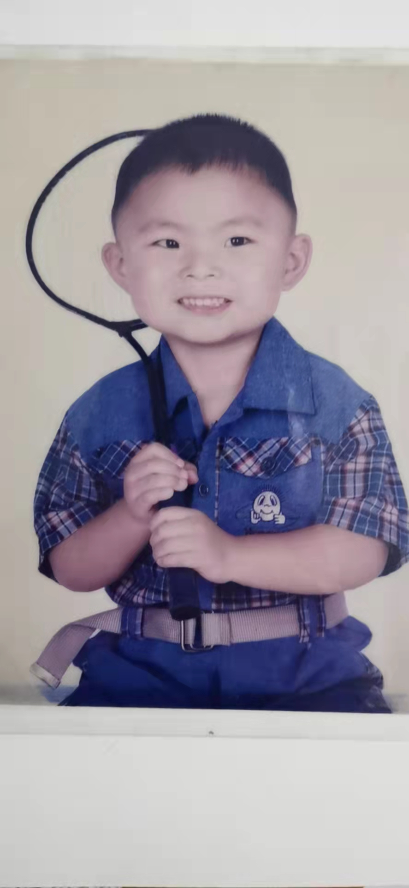

# **Two Photos of myself**

---

Without more words, here is a photo of my big head. When I was young, there was nothing else but my head was very big.

Here is my appearance now:

>Hello everyone, this is me, Zhao Feifan. I am optimistic, cheerful, approachable, live regularly and love doing sports.

>This is the first time I use Markdown to write contents, so I'm going to use my shortened resume to help me become proficient with some markdown editing.

<space><space>

# **Education Experience**

---

## 1. Undergraduate: Nanjing University  2016/9--2020/6
>Major: industrial Engineering
>Prerequisite courses: calculus, linear algebra, probability theory, stochastic process, numerical analysis, operational research, C programming language, supply chain management, etc.

## 2. Master: Chinese University of Hong Kong  2020/9--2021/11**
>Major: System Engineering and Engineering Management

>Prerequisite courses: operation management, project management, information technology, engineering economics, supply chain management, financial engineering, random investment model, etc.

<space><space>

# **Research and project experience**

## 1. Research on Portfolio Based on Deep Learning
## 2. Research on Investor Behavior Based on Fund Manager Network
## 3. JD.COM Global Optimization Challenge

* A solution that can optimize the route to deliver goods to customers quickly and minimize the delivery cost under various constraints (including vehicle capacity and delivery time) is developed.
  
* Work with my team members to decide which operator can be used to implement the algorithm with complexity O(n).
  
* Learning the algorithm ideas such as genetic algorithm, applying the routing theory to intelligent logistics cases, a practical method to solve the real distribution problem is proposed.

## 4. The 15th "Citi Cup" Financial Innovation and Application Competition  04/2018-10/2018

* We develop a tradable asset allocation app based on AI, which can provide customers with the best portfolio. Also, we collect data through professional websites, analyze the asset allocation of stock market and bond market, and build a financial framework in pairs.
* According to traceable data and literature, we find out appropriate statistical indicators to predict asset covariance.
* Markov chain is introduced to describe customers' investment trends, and regular monitoring is carried out.
* We apply modeling knowledge to practice through teamwork: stimulate the creativity of financial innovation by proposing solutions with commercial prospects.

<space><space>

# **Intership Experience**

---

## 1. Cinda Securities Practice
## 2. Suning head office
## 3. industrial practice

<space><space>

# **Social Practice**

---

## Investigation on Current Situation of Agricultural Products Network Marketing in Putian and Wuyishan  07/2017
* Consult senior officials of relevant government departments.
* Consult the manager of e-commerce of agricultural products and managers of food chain stores and local enterprises.
* Analyze the recording of the above interview and complete a practical investigation report.
* He was nominated as an excellent organizer and participated in the defense as a student representative of the school. 

<space><space>

# **extracurricular activities**

---

## 1. Communist Youth League Secretary, School of Engineering Management    09/2018--06/2020

## 2. Deputy Secretary of Youth League Committee of School of Engineering Management    10/2017--09/2018

## 3. Badminton player of School of Management  03/2018

## 4. Member of Nanjing University Rubik's Cube Association   06/2017

## 5. Participants in super brain Rubik's Cube Competition    12/2016

## 6. Class Committee of School of Management                 09/2016

<space><space>

# **Volunteer experience**

---

## 1. Nanjing Science and Technology Museum Volunteer    06/2018

## 2. Nanjing University Love Bookstore Volunteers	      03/2017-05/2018

## 3. The new village supports education, providing math English tutoring for children from poor families	                     03/2017-06/2017

## 4. Charity 100 fund-raising activity (initiated by China Foundation for Poverty Alleviation)	                              09/2016-12/2016

<space><space>

# **Award winning experience**

---

## 1. Nanjing University People's Second Class Scholarship    11/2018

## 2. Seventh place in JD.COM Operation Competition           10/2018

## 3. The first prize of the 15th "Citi Cup" Financial Innovation and Application Competition                                    10/2018

## 4. The second prize of American College Students Mathematical Modeling Competition                                                03/2018

## Excellent social practice report                        10/2017

<space><space>

# **Skills and hobbies**

---

## 1. Computer skills:	C, MATLAB, Cplex, LaTex; R, Python, SAS

## 2. Hobbies: Rubik's cube -20s, playing badminton, swimming and reading.

<space><space>

# **This is my shortened resume. In a word, I think maekdown is too great. Best wishes to everyone!**
